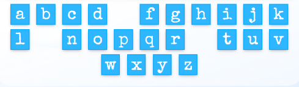

# DISAPPEARING SNOWMAN - GAME
## OVERVIEW
Disappearing Snowman is a game created only with HTML, CSS and pure JavaScript. The idea came from my desire to use only JavaScript as backend technology to develop an application that interacts with the user in many ways, in order to learn more about how it can be used.  
The game is designed for children in particular, but not only because it can be played on several levels of difficulty. It is another version of the Hangman game but more child-friendly. This is a fully responsive application where the user can play and try to guess each word that appear only as an underscores string, by selecting different letters from the alphabet.
Disappearing Snowman can be considered a great type of activity for the little ones to learn how different things are spelled or for anyone who is passionate about guessing words and wants to beat his own best scores.
  
The game can be accesed at [this link](https://useriasminna.github.io/disappearing-snowman-game/). 

## UX/UI
This game was created respecting the Five Planes Of Website Design: 

### STRATEGY
#### Goals 
* The game should be intuitive and easy to navigate 
* Every user's interaction with the game should have a proper feedback 
* The game should be responsive for all devices 
* The content of the game should be fully accessible to everyone, including people with disabilities 
* The game should tell the user how to play it 
* All the images and ilustrations of the game should be of good quality 

#### User Stories 
* As a user, I want to understand the game's purpose from the first interaction with it 
* As a user, I want the game to be visually atractive 
* As a user, I want to easily navigate through the game 
* As a user, I want to be able to choose the level of difficulty for the game 
* As a user, I want to see feedback from my interaction with the game 
* As a user, I want the game to be easy to play 

### SCOPE 
For the implementation of the game I have planned the following features:

* Home page for the user to get familiar with the game's purpose
* Sound control for background music
* A game menu for the user to choose the difficulty of the game he wants to play
* Highlighted buttons to show the user how to navigate the game
* A game section in which there is the word string and its hint
* A game section where the user can pick up letters from the alphabet to guess the word
* Features that will show the user if the chosen letter was correct or incorrect
* A dynamic score section that updates its value with each success or failure of the user
* Propper messages to be desplayed to the user in case of errors or other types of exceptions

### STRUCTURE 
Disappearing Snowman is a game with a unique html page. The game has a default home page where the user can become familiar with the game and choose the difficulty of the game. All other content of the running game will be dynamically loaded with JavaScript when the user presses the PLAY button.
The section in which the game runs consists of four parts.
There is an area where the underscores for the word and its hint are displayed, and a second area for the snowman cartoon that changes its shape. There is also a section for the letters of the alphabet that can be chosen by the user and the last one that memorise the game score.

  
### SKELETON 
The wireframes for mobile and desktop were created with [Balsamiq](https://balsamiq.com/) tool and can be viewed [here](assets/wireframes/wireframes.pdf) 

### SURFACE 
#### Color Scheme
Considering that the main theme of the game is winter, all the colors used for creating the design are mostly shades of blue and whites.  

 Also, the main character of the game is a smiling snowman which is built, among others,from elements in purple and orange, shades also used for highliting buttons and other important elements.  

#### Images
* The snowman cartoon image is downloaded from [CLIPARTMAX](https://www.clipartmax.com/max/m2H7i8Z5G6Z5K9N4/) 
* The snowman from the running game is built from images as pieces of his body cut from the original cartoon, in order to fall one at a time 
* The game background image is downloaded from [WallpaperCave](https://wallpapercave.com/w/wp4667138)  

#### Fonts
* The fonts used in the game are Special Elite and Bangers and both were imported from [Google Fonts](https://fonts.google.com/)

## FEATURES
All the actions that take place in the game are created after a clear structure and logic that is represented in this [Flowchart](assets/flowchart/Disappearing_Snowman_Flowchart.pdf).   
### EXISTING FEATURES 
This game has multiple features that were created to make it an easy and intuitive game to play for children and adults as well.
  
* When the game first loads the user will see the home page which has the role to familiarize him with the game. 
  The theme of the game can be easily understood from the winter background and the snowman character that is placed on the page. Also, the rules for the game were clearly written for everyone to understand. 
  
  

* For a full experience, the game offers winter background sound as well which is set to be off by default but can be controled by the user. 
  

* A very important feature is the menu in the home page with the difficulties options for the game. Once a level is chosen and the user press Play, the game content will be generated depending on the user's choice. 
  

* These buttons are placed in the home page, as well in the game section and modals to help the user navigate easily through the game. 
  
  

* An important feature of the game is the one that displays the underscores string for the random word that the user has to guess. Every word comes with a hint to help the player, that will change every time the word is changing. The hint is actually a definition of the word get from the MerRiam Webster Dictionary API. 
  

* In order for the user to play there exists a feature that will let him chose a letter from the alphabet to complete the word. This is the most important feature because it decides what other features will be activated depending on the user's choice. 
  

* Everytime a user makes a choice for the letter, either correct or incorrect, the game will give the user a feedback for his choice. When the letter its correct,the game will fill the word string with the letter and will change the snowman shape and decrease its life when its incorrect. 
  
  
  

* Another important feature is the score element that updates its value everytime a player succeds or fails in guessing a word. 
    

* The game was created to be preventive for certain errors and it displays different messages to inform the user what is wrong or could happen. 
  
  
  

### FUTURE FEATURES 
* Create a database with words and hints for each level to eliminate the possibility for the list of the words to end
* Filter the words by categories and let the user choose one of them before playing

## UNFIXED BUGS OR ERRORS
* The definitions get from the Merriam Webster Dictionary API as hints for the words should be better filtered because some of them don't indicate the right sense of the word. Also, in order to make them shorter, I tried to delete parts of the definitions that comes after symbols like "-", ":" using JavaScript, but I noticed it doesn't always work properly and should be fixed.
* The game should have an <code>beforeunloaded</code> event to inform the user it will loose the game progress if he leaves the page.

## TESTING
### USER STORY TESTING

<b>User Story: </b>As a user, I want to understand the game's purpose from the first interaction with it 
<b>Outcome: </b> When the user first loads the game will see different elements that indicate what type of game it is. 
The title sugerates the game's theme as the main action of it is happening around the idea of saving a snowman from melting, the main character is placed on the page as a cartoon of a snowman and there is a detailed description of the game rules to make everyone understand from the start how the game can be played.   
<b>User Story:</b>As a user, I want the game to be visually atractive 
<b>Outcome:</b>The background and every color used for creating the game design were chosed to sugerate the idea of winter.  The design was especially made to be attractive for the kids and not only.  There are no white spaces left and all the elements are in good contrasts.  The content passed the accessibility test and the report can be viewed [here](https://wave.webaim.org/report#/https://useriasminna.github.io/disappearing-snowman-game/index.html).   
<b>User Story:</b>As a user, I want to easily navigate through the game 
<b>Outcome:</b> In the home page and after the running game is loaded as well, there are multiple buttons and links that sugerates the user the right direction through the game.  
These buttons have sugestive text like: PLAY, START NEW GAME, TRY ANOTHER ONE, PLAY ANOTHER WORD.  </b>  
<b>User Story:</b>As a user, I want to be able to choose the level of difficulty for the game 
<b>Outcome:</b> On the start page there is a menu available for the user where he can choose from three different type of game difficulties: easy, medium, hard. The selection of each one of these will generate different outcome for the game.  
<b>User Story:</b>As a user, I want to see feedback from my interaction with the game 
<b>Outcome:</b>Every element that is clickable have a hover effect and triggers different actions such as game loading, changing elements value on the page, displaying suggestive messages and modals content, redirects to external pages.  
<b>User Story:</b>As a user, I want the game to be easy to play 
<b>Outcome:</b>The game action flow is simple and intuitive. The user only have to pick up a level to start the game and try to guess the word by pressing letters from the keyboard. Every decision that he can make to change the word or start a new game is possible through the higlighted buttons always existent on the screen.   

### FEATURES TESTING
I have manually tested every feature of the game to make sure everything works properly.

<b>Feature:</b> Home page for the user to get familiar with the game's purpose 
<b>Testing:</b> I have opened the game and the first content that appears is suitable for this feature purpose. 
There is present a sugestive title whitch is also a hyperlink to the start page. This is set to trigger a modal for leaving the game but only when the game is active, when the user is in the start page, clicking the title will only refresh the page.I have tested this feature and it works properly. 
The subtitle makes refference to another very known game with simillar rules. 
  

On the screen can be found two more elements that sugerates the game's theme and purpose, a snowman cartoon and a text element with the game rules. I tested and they are visible on all screen sizes.  
  
    

<b>Feature:</b> Sound control for background music 
<b>Testing:</b> On start page I have implemented a method that will play and pause an audio file as background music for the game. 
I tested the feature and everytime I open the game the sound is off to give the user the possibility to control it. 
 When the user clicks the sound the icon will change to sugerate whether the sound plays or noT. Also the sound mentain its state when the game starts but gets back to its initial setting when the page is refreshed. This feature is tested and works fine. 
  
    

<b>Feature:</b> A game menu for the user to choose the difficulty of the game he wants to play 
<b>Testing:</b> I have implemented this feature to give the player the possibility to choose at which level he wants to play. 
On start page there is a menu with three different elements for level selection. For each element selected by the user there is a different style that applies to it to highlight the active element. The user can switch between levels and the style only remain active for the last one chosen. 
   
I have also tested the case in which the user hits the PLAY button without selecting a difficulty level and a warning appears to inform the user. The game doesn't start until a level is active. 
   

<b>Feature:</b> Highlighted buttons to show the user how to navigate the game 
<b>Testing:</b> I have implemented different buttons with sugestive text that will sugerate the user exactly the action that he can do by pressing them. 
I have tested each one of the buttons and they all redirect the user to the right path. 

  * The <b>PLAY</b> button is set to replace the game Start page with the actual game and to generate its content depending on the level difficulty chose by the player. This action is visible in the value of the Difficulty element which is placed in the game-area to remember the user what level is he playing. 
  
    

 * After hitting the PLAY button the game loads and other features are availabe. The <b>TITLE</b> its a hyperlink and redirects the user to the Start page but when the game mode is on, clicking on it will show a leaving page modal everytime to inform the player he will loose his progress. The modal gives the player the option to leave or stay in the game. This feature is tested and works on every device.  
    

 * Another element very important for the game is <b>TRY ANOTHER ONE</b> button which gives the user the possibility to change the word that he plays without affecting the score. I tested this feature and everytime this button is active it will generate another random word and replace its matching underscores string in the game area, as well as its corresponding hint. 
    

 * To make the game complete I have implemented a button for the user to <b>START A NEW GAME</b>. This is linked to the start page and acts as the title because it displays the same leaving page modal when its clicked. 
    

<b>Feature:</b> A game section in which there is the word string and its hint 
<b>Testing:</b> This section elements are generated depending on the difficulty level selected. 
The word is randomly chosen from an array that includes only words matching the selected level. The word is represented in the game as a string that contains only underscores and spaces to give the player a clue about the number of characters. Also, the hint is set to be updated every time the word changes by making a request to get the word definition from Merriam Webster Dictionary API. It appears initially as a light icon which is set to be replaced by a string at the user's action of <code>click</code>. Everytime a new word is generated the hint comes back to its initial state. 
   
     
I have tested this feature on all devices and it works properly. When there are no more words in the list, the game displays a warning.  
     

<b>Feature:</b> A game section where the user can pick up letters from the alphabet to guess the word 
<b>Testing:</b> I have implemented a keyboard for the user to choose the letters for completing the word. 
Every element of the keyboard is set to become invisible after being selected. I have manually tested each one of the letters to make sure the player will not be able to reselect or initiate any kind of action after clicking on them. 
   
     

<b>Feature:</b> Features that will show the user if the chosen letter was correct or incorrect 
<b>Testing:</b> When a keyboard element is selected there are two actions that can happen. 
When the letter is correct it is included in the word and when it is wrong the snowman cartoon will change its shape depending on the life remained. 
  
     
Also, for each one of this actions a modal can be triggered if the word is completed or the snowman has no life left. 
I have manually tested every case to make sure this feature has no errors. 
  
     
<b>Feature:</b> A dynamic score section that updates its value with each success or failure of the user 
<b>Testing:</b> This feature was created to memorise the score of the game until another one begins. The values are updating every time the Success or Failure modal appears and the player choose the Play another word option.
I have tested the feature to see if it updates the score value in the right case and it gets back to its initial state every time a new game starts. 
   
     

