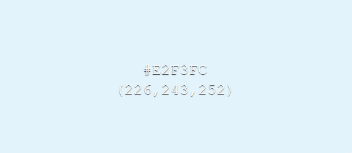
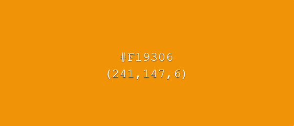
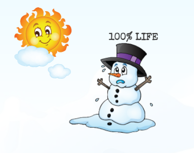
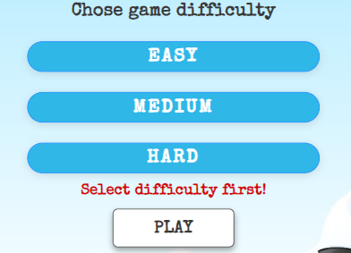

# DISAPPEARING SNOWMAN - GAME
## OVERVIEW
Disappearing Snowman is a game created only with HTML, CSS and pure JavaScript. The idea came from my desire to use only JavaScript as backend technology to develop an application that interacts with the user in many ways, in order to learn more about how it can be used. 
The game is designed for children in particular, but not only because it can be played on several levels of difficulty. It is another version of the Hangman game but more child-friendly. This is a fully responsive application where the user can play and try to guess each word that appear only as an underscores string, by selecting different letters from the alphabet.
Disappearing Snowman can be considered a great type of activity for the little ones to learn how different things are spelled or for anyone who is passionate about guessing words and wants to beat his own best scores.

  
The game can be accesed at [this link](https://useriasminna.github.io/disappearing-snowman-game/). 

## UX/UI
This game was created respecting the Five Planes Of Website Design:  

### STRATEGY
#### Goals 
* The game should be intuitive and easy to navigate 
* Every user's interaction with the game should have a proper feedback 
* The game should be responsive for all devices 
* The content of the game should be fully accessible to everyone, including people with disabilities 
* The game should tell the user how to play it 
* All the images and ilustrations of the game should be of good quality 

#### User Stories 
* As a user, I want to understand the game's purpose from the first interaction with it 
* As a user, I want the game to be visually atractive 
* As a user, I want to easily navigate through the game 
* As a user, I want to be able to choose the level of difficulty for the game 
* As a user, I want to see feedback from my interaction with the game 
* As a user, I want the game to be easy to play 

### SCOPE 
For the implementation of the game I have planned the following features:

* Home page for the user to get familiar with the game's purpose
* Sound control for background music
* A game menu for the user to choose the difficulty of the game he wants to play
* Highlighted buttons to show the user how to navigate the game
* A game section in which there is the word string and its hint
* A game section where the user can pick up letters from the alphabet to guess the word
* Features that will show the user if the chosen letter was correct or incorrect
* A dynamic score section that updates its value with each success or failure of the user
* Propper messages to be desplayed to the user in case of errors or other types of exceptions

### STRUCTURE 
Disappearing Snowman is a game with a unique html page. The game has a default home page where the user can become familiar with the game and choose the difficulty of the game. All other content of the running game will be dynamically loaded with JavaScript when the user presses the PLAY button.
The section in which the game runs consists of four parts.
There is an area where the underscores for the word and its hint are displayed, and a second area for the snowman cartoon that changes its shape. There is also a section for the letters of the alphabet that can be chosen by the user and the last one that memorise the game score.

  
### SKELETON 
The wireframes for mobile and desktop were created with [Balsamiq](https://balsamiq.com/) tool and can be viewed [here](assets/wireframes/wireframes.pdf) 

### SURFACE 
#### Color Scheme
Considering that the main theme of the game is winter, all the colors used for creating the design are mostly shades of blue and whites.  

 Also, the main character of the game is a smiling snowman which is built, among others,from elements in purple and orange, shades also used for highliting buttons and other important elements.  

#### Images
* The snowman cartoon image is downloaded from [CLIPARTMAX](https://www.clipartmax.com/max/m2H7i8Z5G6Z5K9N4/) 
* The snowman from the running game is built from images as pieces of his body cut from the original cartoon, in order to fall one at a time 
* The game background image is downloaded from [WallpaperCave](https://wallpapercave.com/w/wp4667138)  

#### Fonts
* The fonts used in the game are Special Elite and Bangers and both were imported from [Google Fonts](https://fonts.google.com/)

## FEATURES
### EXISTING FEATURES 
This game has multiple features that were created to make it an easy and intuitive game to play for children and adults as well.  
* When the game first loads the user will see the home page which has the role to familiarize him with the game. 
  The theme of the game can be easily understood from the winter background and the snowman character that is placed on the page. Also, the rules for the game were clearly written for everyone to understand. 
  
  

* For a full experience, the game offers winter background sound as well which is set to be off by default but can be controled by the user. 
  

* A very important feature is the menu in the home page with the difficulties options for the game. Once a level is chosen and the user press Play, the game content will be generated depending on the user's choice. 
  

* These buttons are placed in the home page, as well in the game section and modals to help the user navigate easily through the game. 
  
  

* An important feature of the game is the one that displays the underscores string for the random word that the user has to guess.Every word comes with a hint to help the player, that will change with the word changing.The hint is actually a definition of the word get from the MerRiam Webster Dictionary API. 
  

* In order for the user to play there exists a feature that will let him chose a letter from the alphabet to complete the word. This is the most important feature because it decides what other features will be activated depending on the user's choice. 
  

* Everytime a user makes a choice for the letter, either correct or incorrect, the game will give the user a feedback for his choice. When the letter its correct,the game will fill the word string with the letter and will change the snowman shape and decrease its life when its incorrect. 
  
  
  

* Another important feature is the score element that updates its value everytime a player succeds or fails in guessing a word. 
    

* The game was created to be preventive for certain errors and it displays different messages to inform the user what is wrong or could happen. 
  
  
  

### FUTURE FEATURES 
* Create a database with words and hints for each level to eliminate the possibility for the list of the words to end
* Filter the words by categories and let the user choose one of them before playing

## UNFIXED BUGS OR ERRORS
* The definitions get from the Merriam Webster Dictionary API as hints for the words should be better filtered because some of them don't indicate the right sense of the word. Also, in order to make them shorter, I tried to delete parts of the definitions that comes after symbols like "-", ":" using JavaScript, but I noticed it doesn't always work properly and should be fixed.
* The game should have an <code>beforeunloaded</code> event to inform the user it will loose the game progress if he leaves the page.

